# 정렬 비교 보고서 — 병합 · 퀵 · 힙

2026-2 고급알고리즘(SIT2001-01) 1차 과제 · 2026193020 김성혁

- 저장소: <https://github.com/SungHyuk108/Advanced_algorithm_SungHyukKim_Comparing_Sorting>
- 구현: [`src/mergeSort.c`](../src/mergeSort.c) · [`src/quickSort.c`](../src/quickSort.c) ·
  [`src/heapSort.c`](../src/heapSort.c)
- 실행: `make run` (비교 표) · `make test` (유닛 테스트) · `make charts` (그래프)
- 환경: 컨테이너 안 `gcc -std=c17 -Wall -Wextra -O2`

---

## 차례

1. [개요](#1-개요) — 무엇을 왜 비교했나
2. [본론](#2-본론)
   - 2.1 [코드 전반적인 구조 분석](#21-코드-전반적인-구조-분석)
   - 2.2 [정렬별 동작 과정](#22-정렬별-동작-과정)
   - 2.3 [알고리즘 실험](#23-알고리즘-실험)
   - 2.4 [공간 복잡도](#24-공간-복잡도)
3. [소감 및 결론](#3-소감-및-결론)

---

## 1. 개요

이번 정렬 알고리즘 과제에서 비교하고 싶었던 것은 세 가지였다. **합치는 데
비용이 드는 병합 정렬**, **나누는 데 비용이 드는 퀵 정렬**, 그리고 나누지도
합치지도 않고 "힙"이라는 독특한 구조 아래에서 작동하는 **힙 정렬**이다.

더 정확히 말하면, 강의 교본의 **"나누기와 결합은 시소"** 라는 표현을 기반으로
이 정렬들을 선택했다고 봐도 무방하다. 한쪽에서 일하면 다른 쪽이 공짜가 된다는
것이 그 틀인데, 병합과 퀵이 그 시소의 양 끝이다. 배우지 않은 정렬로 힙을 고른
이유도 여기에 있다. 힙은 시소의 어느 쪽도 아니다 — **시소 자체를 벗어난 세
번째 경우**다.

| | 정렬 | 수업에서 | 나누기 | 결합 | 치르는 값 |
| --- | --- | --- | --- | --- | --- |
| 1 | **병합 정렬** | 배움 | 공짜 (위치로 반 자름) | **여기서 일한다** | `temp` 배열 `O(n)` |
| 2 | **퀵 정렬** | 배움 | **여기서 일한다** (값으로 가름) | 공짜 | 최악 `O(n²)` · 불안정 |
| 3 | **힙 정렬** | **안 배움** | — | — | 무작위 입력에서 가장 느림 |

세 정렬을 같은 조건에서 돌리고 **실행 시간 · 비교 횟수 · 이동 횟수 · 재귀
깊이** 네 가지를 쟀다.

---

## 2. 본론

### 2.1 코드 전반적인 구조 분석

코드의 전반적인 구조는, 교수님께서 바이브 코딩을 강조하셨듯이 교수님께서
올려놓으신 샘플 보고서와 코드 형식을 참고하여 진행하였다.

기본적으로 세 정렬을 제대로 분석하고 측정하려면 **각 정렬마다 측정 코드를
따로 두는 것이 아니라 하나의 공통된 인터페이스가 필요하겠다**는 판단에서
출발했다. 측정 조건이 정렬마다 조금씩 어긋나면 비교 자체를 믿을 수 없기
때문이다. 그래서 `sort.h`를 먼저 만들고, 여러 정렬 알고리즘을 그 약속에 맞춰
구현한 뒤, 그것을 `bench.c`에 넣어 측정하고 결과를 `main.c`가 찍게 하였다.

#### 공통 인터페이스

C에는 자바의 `interface`도 클래스도 없다. 대신 **함수 포인터를 담은
구조체**를 쓴다.

```c
/* src/sort.h */
typedef struct SortAlgorithm {
    const char *name;
    const char *best;    /* 최선 시간복잡도 */
    const char *average; /* 평균 */
    const char *worst;   /* 최악 */
    const char *space;   /* 추가 공간 */
    int stable;          /* 안정 정렬이라고 "주장"하는 값 */
    void (*sort)(Record *a, size_t n, SortStats *st);
} SortAlgorithm;

extern const SortAlgorithm SORT_ALGORITHMS[];   /* 구현 목록 */
```

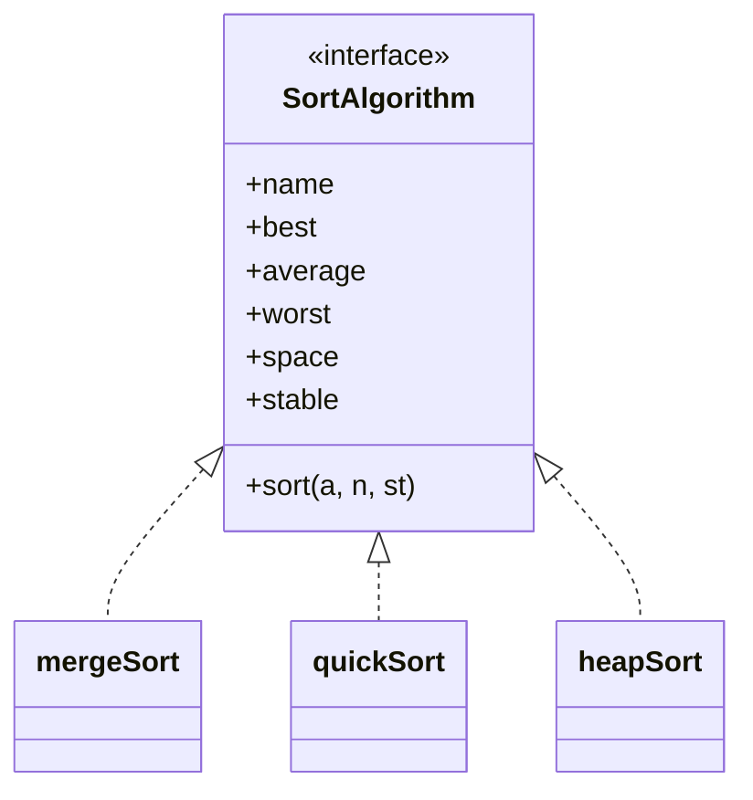

자바라면 `implements` 한 줄이었을 것이 여기서는 **표에 한 줄 넣는 것**이다.

```c
/* src/sort.c */
const SortAlgorithm SORT_ALGORITHMS[] = {
    {"merge", "O(n log n)", "O(n log n)", "O(n log n)", "O(n)",     1, mergeSort},
    {"quick", "O(n log n)", "O(n log n)", "O(n^2)",     "O(log n)", 0, quickSort},
    {"heap",  "O(n log n)", "O(n log n)", "O(n log n)", "O(1)",     0, heapSort},
};
```

#### 층 구조

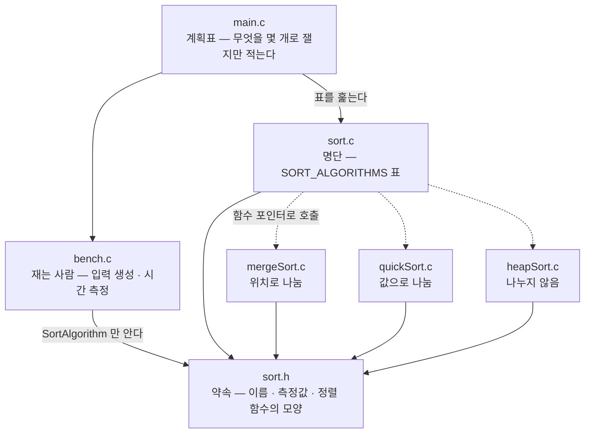

이때 `bench.c`와 `main.c`에는 **특정 정렬과 관련한 설명이 한 줄도 없다.**
`SORT_ALGORITHMS` 표를 훑을 뿐이다. 그래서 온전히 세 정렬의 결과를 독립적으로
볼 수 있다고 봐도 무방하다고 생각한다. 정렬을 하나 더 넣고 싶다면 그 표에 한
줄을 더하는 것으로 끝나고, 유닛 테스트도 같은 표를 훑으므로 그 순간부터 같은
검사를 자동으로 받는다.

| 파일 | 맡은 것 |
| --- | --- |
| `sort.h` | 바깥에 보이는 인터페이스 (`Record`, `SortStats`, `SortAlgorithm`) |
| `sort.c` | `SORT_ALGORITHMS` 표와 결과를 살펴보는 공용 함수 |
| `mergeSort.c` · `quickSort.c` · `heapSort.c` | 알고리즘 하나씩 |
| `bench.c` | 입력 생성과 시간 측정 (알고리즘은 자기가 측정당하는 줄 모른다) |
| `main.c` | 비교 표 출력. `--csv`를 주면 같은 측정을 CSV로 찍는다 |
| `tools/plot.py` | 그 CSV로 그래프(SVG)를 그린다. 표준 모듈만 쓴다 |

세 구현이 모두 `swap`이라는 같은 이름의 함수를 갖고 있는데도 링크가 깨지지
않는다. `static`을 붙여 파일 밖으로 이름이 새어 나가지 않게 했기 때문이다.
C에서 파일 단위로 무언가를 감추는 방법이 이것이라는 것을 이번에 알았다.

#### 횟수는 어떻게 셌나

횟수 계산은 카운터를 증가시키는 문장을 알고리즘 중간에 직접 넣어서 책정하였다.
강의자료가 `(*comparisons)++`를 놓은 자리와 같은 위치다.

중간에 `swap`을 하는 경우는 **이동이 3번 일어났다**는 것을 시행착오를 통해
확인한 뒤 수정하였다. 교환 한 번은 `tmp = a[i]; a[i] = a[j]; a[j] = tmp`로 대입
세 번이기 때문이다. 이 규약을 맞춰야 병합의 이동(대입 1회 = 1)과 퀵의
이동(교환 1회 = 3)을 **같은 단위로** 견줄 수 있다. 교환을 1로 세면 퀵이
부당하게 유리해 보인다.

| 규약 | 세는 값 |
| --- | --- |
| 대입 1회 | 이동 **1** |
| 교환 1회 | 이동 **3** |
| 제자리 교환 (`i == j`) | **세지 않는다** — 아무것도 옮기지 않으므로 |

셋째 규약이 없으면 "퀵은 정렬된 입력에서 이동 0회"라는 강의자료의 결과가
재현되지 않는다.

#### 구현이 맞는지 어떻게 확인했나

강의자료가 주제 02~04 내내 쓰는 배열 `2 8 5 9 1 10 7 6 4 3`을 넣어 계수를
맞춰 보았다. 코드가 글자 단위로 강의 코드와 같을 필요는 없고, **같은
알고리즘·같은 계수 규약**이면 같은 숫자가 나온다.

| | 강의자료 | 우리 구현 |
| --- | --- | --- |
| merge | 비교 22 · 이동 68 | **비교 22 · 이동 68** |
| quick | 비교 25 · 이동 21 | **비교 25 · 이동 21** |

이와 별도로 `make test`가 크기 0·1·2·3·7·64·1000 × 입력 4종에서 결과가 옳은지,
원소를 잃거나 만들어 내지 않았는지, 안정성 주장과 실측이 어긋나지 않는지를
검사한다. 테스트는 정답을 **자기 손으로 만든 버블 정렬**로 마련한다. 검사받는
코드로 정답을 만들면 "원소를 잃지 않았는가"를 따질 수 없기 때문이다.

```console
$ make test
...
모두 통과
```

---

### 2.2 정렬별 동작 과정

#### 병합 정렬

나누는 것은 사실상 인덱스 산술 한 줄이므로 비용이 들지 않는다고 볼 수 있으나,
**합칠 때 비용이 발생하는** 정렬이다. 배열을 원소 하나가 될 때까지 절반씩
나눈 뒤 — 초기 원소 수가 `n`이면 `log₂n`번 나뉜다 — 인접한 두 덩어리를 합치며
대소를 비교하여 정렬한다.

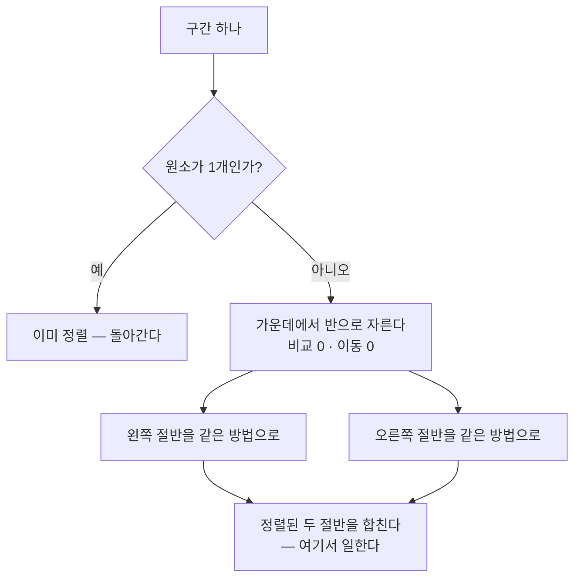

합치는 일은 정렬된 두 절반의 **맨 앞끼리만** 견주어 작은 쪽을 꺼내는 것이다.
그래서 구간 하나를 합치는 데 드는 비교는 구간 크기를 넘지 않는다.


이 과정을 전체 계수 `n`에 대하여 `log n`번 반복하므로 시간 복잡도가
`O(n log n)`이다. 그리고 **나누는 방식이 값이 아니라 위치이기 때문에 입력이
어떻게 생겼든 반씩 갈린다.** 그래서 최선·평균·최악이 모두 `O(n log n)`으로
같다 — 무너지는 입력이 없다.

| | 최선 | 평균 | 최악 |
| --- | --- | --- | --- |
| 병합 정렬 | `O(n log n)` | `O(n log n)` | `O(n log n)` |

또한 병합 정렬은 **안정성**을 지닌다. 두 값이 같을 경우 `<=`를 통하여 왼쪽
(앞부분)을 먼저 선택하는 방식으로 하여, 원래 배열에서 앞에 있었던 원소를 최종
결과에서도 먼저 배치할 수 있게 되므로 안정적이라고 볼 수 있다.

```c
if (a[i].key <= a[j].key) {   /* '<' 이면 같은 값일 때 오른쪽이 먼저 나가 불안정해진다 */
    temp[k++] = a[i++];
}
```

부등호 한 글자가 안정성을 만든다.

#### 퀵 정렬

합치는 것은 그저 피벗을 기준으로 바로 이어 붙이면 되는 것이기에 비용이 들지
않는다고 볼 수 있으나, **나눌 때는** 피벗을 기준으로 작은 것과 큰 것을 갈라야
하기에 원소 전체 `n`을 훑어야 한다. 보통 모든 단계를 수행하면 `log n`이므로
`O(n log n)`이라고 볼 수 있다.

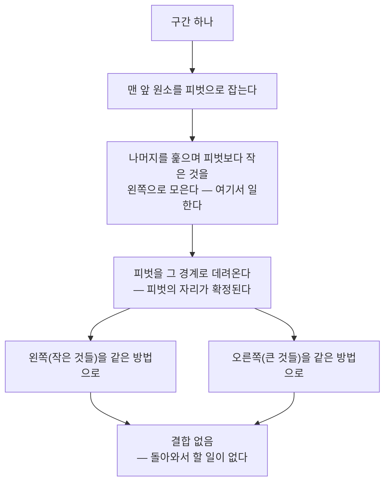

파티션이 피벗의 자리를 확정하면 왼쪽은 모두 피벗보다 작고 오른쪽은 모두 크거나
같다. 두 블록이 최종 배열에서 차지할 구역이 이미 갈렸으므로 결합은 할 일이
없다. 병합 정렬과 뼈대가 같은 재귀인데 **일하는 자리가 정반대**인 셈이다.

부가적으로, 퀵 정렬은 **피벗을 어떻게 잡느냐에 따라서 성능이 크게 달라진다.**
이 구현은 강의자료와 같이 구간의 맨 앞 원소를 피벗으로 쓰는데, 그러면 이미
정렬된 입력에서 매번 최솟값이 피벗으로 뽑혀 구간이 한 칸씩밖에 줄지 않는다.

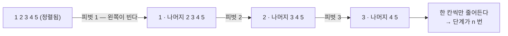

이것이 최악의 경우 `O(n²)`이 되는 이유다. 보완책으로는 피벗을 완전히 랜덤하게
선택하거나, 특정 개수(예: 3개)를 뽑아 그중 중간값을 피벗으로 잡는
median-of-3 방식이 될 수도 있다고 보여진다. **다만 이 과제에서는 그 최악을
실제로 재어 보는 것이 목적 중 하나이므로 일부러 맨 앞 피벗을 그대로 두었다.**
고치면 최악이 사라져 볼 것이 없어지기 때문이다.

| | 최선 | 평균 | 최악 |
| --- | --- | --- | --- |
| 퀵 정렬 | `O(n log n)` | `O(n log n)` | **`O(n²)`** (정렬·역순 입력) |

#### 힙 정렬

배우지 않았던 정렬 방식이다. 어떤 관점에서는 **선택 정렬의 개선안**으로 볼 수
있다. 선택 정렬은 특정 인덱스의 원소를 선택해서 나머지와 모두 비교한 다음, 그
다음 원소를 다룰 때 아까 비교하였던 결과를 사용하는 것이 아니라 다시 버리고
새로 비교를 진행한다. 그러나 힙 정렬은 **비교한 결과를 끝까지 활용하는
정렬**이라고 볼 수 있다.

| | 최댓값 찾기 | 그 결과를 | 한 번의 비용 |
| --- | --- | --- | --- |
| 선택 정렬 | 매번 전체를 훑는다 | **버린다** | `O(n)` |
| 힙 정렬 | 꼭대기를 본다 | **힙으로 남겨 둔다** | `O(log n)` (회복 비용) |

##### 힙이라는 구조

힙의 구조는 사실상 트리의 구조로 시각화할 수 있으며, 위에 있는 원소가 부모,
아래에 있는 원소가 자식으로 구성된다. **부모는 항상 자식보다 크거나 같아야
하며, 자식 간의 크기 차이는 없다.** 전체 정렬보다 훨씬 느슨한 조건이라 유지가
싸면서도, 꼭대기가 언제나 최댓값이므로 최댓값을 찾는 비용이 0이다.

여기서 하나 중요하게 짚을 것은, **트리는 따로 존재하지 않는다**는 것이다.
그저 배열을 특정 규칙에 따라 시각화한 것이기에 공간 복잡도가 `O(1)`이다.
배열을 위층부터, 왼쪽부터 채웠다고 약속한 가정 아래에서 다음이 성립한다.

| 관계 | 인덱스 산술 |
| --- | --- |
| 왼쪽 자식 | `2i + 1` |
| 오른쪽 자식 | `2i + 2` |
| 부모 | `(i - 1) / 2` (정수 나눗셈) |

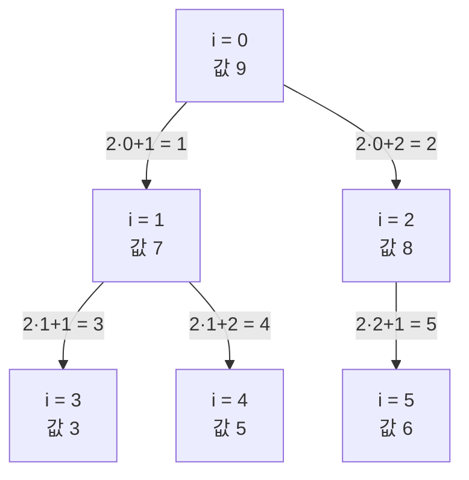

위 트리가 배열에서는 그냥 `[9, 7, 8, 3, 5, 6]` 한 줄이다. 포인터가 하나도 없고
인덱스 산술만 있으므로 추가로 잡는 메모리가 없다. 형제인 `7`과 `8` 사이에는
아무 순서도 없다는 점도 볼 수 있다 — 힙은 그만큼만 요구한다.

##### 1단계 — 배열을 힙으로 만든다

주어진 배열은 아직 힙이 아니므로 먼저 힙 조건을 만들어 준다. 바닥층(원소의
절반)은 자식이 없어 할 일이 없으므로 그 바로 위 노드부터 거꾸로 올라가며
`siftDown`을 부른다. 일이 많은 노드는 개수가 적고 개수가 많은 노드는 일이 적어
서로 상쇄되므로, 이 단계 전체가 `O(n)`에 그친다.

##### 2단계 — 꼭대기를 뒤로 보내며 정렬한다

정렬의 과정은 **꼭대기(가장 큰 원소)와 힙 구역의 맨 뒤 원소의 자리를
바꾸면서** 이루어진다. 이 경우 가장 큰 원소는 배열 마지막에 자리를 잡고,
맨 뒤에 있던 원소가 꼭대기로 올라온다.


정렬된 결과가 배열 뒤쪽에 쌓이고 힙은 앞쪽에서 줄어든다. 한 배열을 두 구역으로
나눠 쓰므로 추가 배열이 필요 없다.

##### siftDown

올라온 원소는 대체로 작아서 힙의 정의(부모는 자식보다 작을 수 없다)를 깨뜨린다.
이를 회복하는 과정이 `siftDown`이다. **올라온 수를 아래 자식 수와 비교하여
자식 중 더 큰 것과 자리를 바꾸고, 이것이 성립하지 않을 때까지 지속**한다.

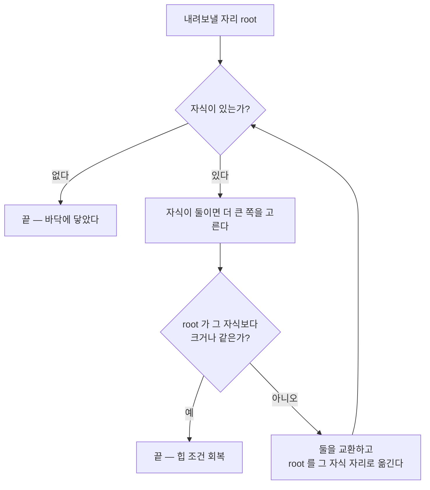

자식이 둘일 때 **반드시 더 큰 쪽**과 교환해야 한다. 작은 쪽을 올리면 그 자리
에서 곧바로 힙 조건이 다시 깨져 헛수고가 되기 때문이다.

한 번의 `siftDown`은 트리의 높이만큼 내려가므로 `log n` 단계를 거치며, 이를
`n-1`개에 대하여 모두 진행해야 하므로 전체가 `O(n log n)`이 나오는 것을 알 수
있다. 그리고 **트리의 높이는 입력이 아니라 원소 개수만으로 정해진다.** 그래서
힙 정렬은 퀵처럼 무너지는 입력이 없고 최선·평균·최악이 모두 같다.

| | 최선 | 평균 | 최악 |
| --- | --- | --- | --- |
| 힙 정렬 | `O(n log n)` | `O(n log n)` | `O(n log n)` |

한편 2단계의 이 교환은 멀리 떨어진 두 원소를 맞바꾸므로 같은 값끼리의 원래
순서를 흐트러뜨린다. 힙 정렬이 **불안정**한 이유가 여기에 있다.

---

### 2.3 알고리즘 실험

#### 실험 개요

같은 입력을 세 정렬에 똑같이 먹이고 네 가지를 쟀다.

| 지표 | 재는 방법 | 재현되는가 |
| --- | --- | --- |
| 실행 시간 (ms) | `clock_gettime`, 복사를 뺀 구간 | 기계·부하를 탄다 |
| 비교 횟수 | 구현이 `SortStats`에 센다 | **완전히 재현된다** |
| 이동 횟수 | 대입 1 · 교환 3 · 제자리 교환 0 | **완전히 재현된다** |
| 재귀 깊이 | 실제로 들어간 최대 깊이 | **완전히 재현된다** |

입력은 네 모양으로 만든다. 이론표의 최선·평균·최악 칸을 실험으로 만들어 내는
장치다.

| 입력 | 역할 |
| --- | --- |
| `random` | 평균에 해당 |
| `sorted` | 맨 앞 피벗 퀵의 최악 |
| `reversed` | 또 다른 최악 |
| `few-unique` (값 8종) | 중복 많음 — 안정성을 가릴 수 있는 유일한 입력 |

**`n = 8192`로 잡은 이유.** 2의 거듭제곱이어야 병합이 바닥까지 정확히 반씩
갈린다. 그렇지 않으면 홀수 구간이 생겨 조각 크기가 들쭉날쭉해지고 실측이
공식과 어긋난다. `n = 2¹³`에서는 실측이 이론값과 자릿수까지 맞아떨어진다.

| 항목 | 공식 | 값 |
| --- | --- | --- |
| 병합 이동 (모든 입력) | `2n·log₂n` | **212,992** |
| 병합 비교 (정렬된 입력) | `n·log₂n / 2` | **53,248** |
| 퀵 비교 (정렬·역순) | `n(n−1)/2` | **33,550,336** |
| 퀵 재귀 깊이 (정렬·역순) | `n` | **8,192** |
| 힙 재귀 깊이 (전부) | `1` | **1** |

**시간은 평균이 아니라 15회 중 가장 빠른 회차를 쓴다.** 측정을 방해하는
것(다른 프로세스, 공유 vCPU를 나눠 쓰는 이웃)은 시간을 늘리기만 하지 줄이지
못하므로, 최솟값이 이 기계의 실력에 가장 가깝고 다시 재도 같은 값이 나온다.
평균을 내면 그때 옆에서 무슨 일이 있었는지까지 같이 재게 된다. 실제로 평균을
쓰던 때에는 똑같은 작업을 두 번 잰 값이 3배까지 벌어졌다.

> 아래 표와 그래프는 **한 번의 같은 실행**에서 나왔고, 그때의 측정값은
> [`results.csv`](results.csv)에 남겼다. `make charts`를 다시 돌리면 새로
> 재므로 시간은 조금씩 달라진다. 비교·이동 횟수는 입력이 고정이라 언제
> 돌려도 같은 값이 나온다.

#### 축을 두 벌 그린 이유

같은 자료를 **선형 축과 로그 축으로 각각** 그린 그림이 있다. 하나로는 절반씩
놓치기 때문이다.

| 축 | 잘 보여 주는 것 | 감추는 것 |
| --- | --- | --- |
| 선형 | 격차의 **크기**. 막대 높이가 곧 값의 비율이다 | 작은 값. 바닥에 붙어 사라진다 |
| 로그 | 작은 값과 **자라는 속도**(기울기 = 복잡도 지수) | 격차의 크기. 눈금 한 칸이 10배다 |

#### 입력 모양별 (n = 8,192)

| 입력 | 알고리즘 | 시간(ms) | 비교 | 이동 | 재귀깊이 | 안정성 |
| --- | --- | ---: | ---: | ---: | ---: | :---: |
| 무작위 | merge | 0.554 | 96,146 | 212,992 | 14 | 안정 |
| 무작위 | quick | **0.378** | 129,320 | 184,500 | 31 | 불안정 |
| 무작위 | heap | 0.555 | 187,630 | 297,435 | 1 | 불안정 |
| 정렬됨 | merge | 0.291 | 53,248 | 212,992 | 14 | n/a |
| 정렬됨 | **quick** | **10.585** | **33,550,336** | **0** | **8,192** | n/a |
| 정렬됨 | heap | 0.413 | 194,316 | 315,918 | 1 | n/a |
| 역순 | merge | 0.305 | 53,248 | 212,992 | 14 | n/a |
| 역순 | **quick** | **15.845** | **33,550,336** | 12,288 | **8,192** | n/a |
| 역순 | heap | 0.409 | 180,760 | 279,546 | 1 | n/a |
| 중복많음 | merge | 0.309 | 92,227 | 212,992 | 14 | 안정 |
| 중복많음 | quick | 1.460 | 4,222,482 | 45,957 | 1,090 | 불안정 |
| 중복많음 | heap | 0.453 | 170,282 | 263,442 | 1 | 불안정 |

##### 걸린 시간

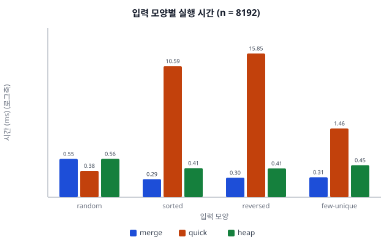

> ✏️ _설명 자리_

##### 비교 횟수

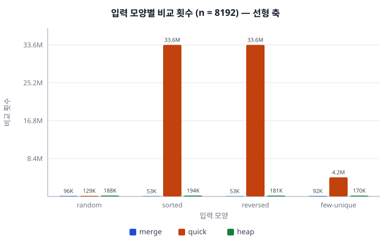

> ✏️ _설명 자리_

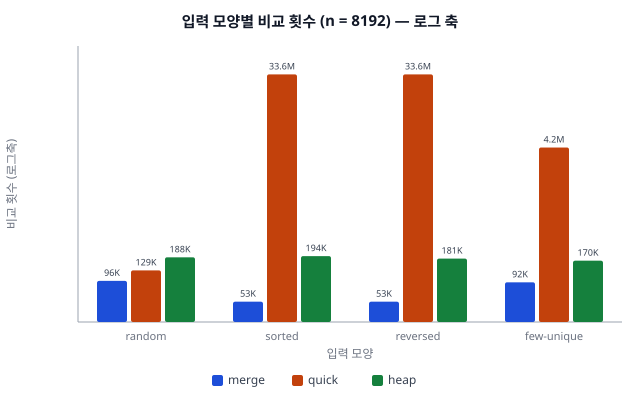

> ✏️ _설명 자리_

##### 이동 횟수

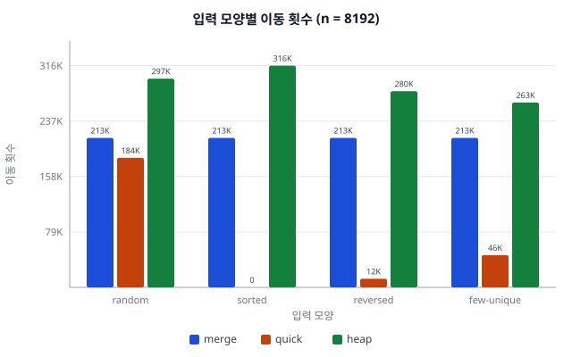

> ✏️ _설명 자리_

##### 재귀 깊이

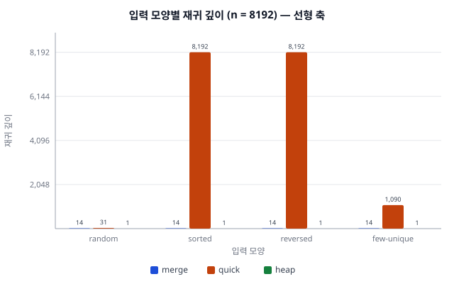

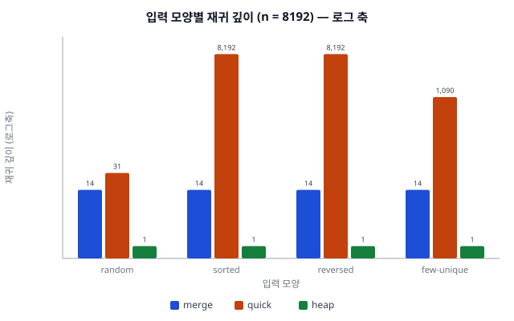

> ✏️ _설명 자리 — 재귀 깊이가 무엇을 뜻하는지는 여기서 다룬다_

#### n을 키우며 (무작위 입력)

| n | merge(ms) | quick(ms) | heap(ms) | merge 비교 | quick 비교 | heap 비교 | merge 깊이 | quick 깊이 |
| ---: | ---: | ---: | ---: | ---: | ---: | ---: | ---: | ---: |
| 2,048 | 0.083 | 0.044 | 0.099 | 19,952 | 25,272 | 38,772 | 12 | 24 |
| 4,096 | 0.231 | 0.209 | 0.243 | 44,023 | 64,528 | 85,695 | 13 | 30 |
| 8,192 | 0.523 | 0.377 | 0.556 | 96,146 | 129,320 | 187,630 | 14 | 31 |
| 16,384 | 1.222 | 1.126 | 1.241 | 208,730 | 288,062 | 408,314 | 15 | 32 |
| 32,768 | 2.552 | 1.927 | 2.700 | 450,210 | 636,910 | 882,006 | 16 | 38 |
| 65,536 | 5.374 | **3.935** | 5.917 | 965,821 | 1,424,177 | 1,894,624 | 17 | 46 |

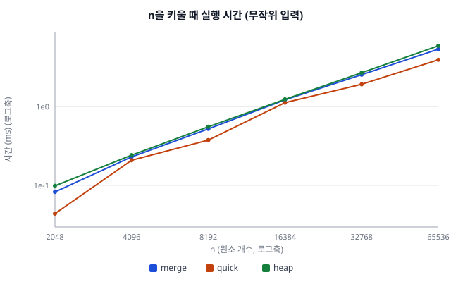

> ✏️ _설명 자리_

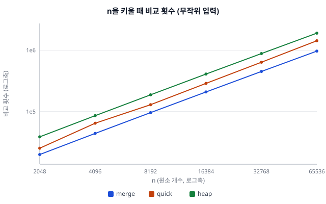

> ✏️ _설명 자리_

#### 안정성 판정

안정성은 한 번 돌려서는 결론 낼 수 없다. 두 가지 함정이 있다.

1. **중복 key가 없으면 판정 자체가 불가능하다.** `정렬됨`·`역순`에서는 어떤
   정렬이든 결과가 같아지므로, 그때의 "안정함"은 판정이 아니라 우연이다.
   그래서 위 표에서 `n/a`로 적었다. `안정`으로 적으면 "확인됐다"로 오해된다.
2. **한 번의 시도에서 불안정 정렬이 우연히 원래 순서를 지킬 수 있다.**

그래서 중복이 많은 입력(값 8종, `n = 1024`)을 **시드 200개**로 돌려 한 번이라도
순서가 깨지면 불안정으로 판정하였다.

| 알고리즘 | 표의 주장 | 안정으로 나온 시도 | 판정 |
| --- | :---: | ---: | :---: |
| merge | 안정 | **200 / 200** | 안정 |
| quick | 불안정 | 0 / 200 | 불안정 |
| heap | 불안정 | 0 / 200 | 불안정 |

> ✏️ _설명 자리_

---

### 2.4 공간 복잡도

추가적으로 생각해 볼 만한 것은 공간 복잡도다. 기본적으로 배운 것들이 모두
시간 복잡도와 관련된 것들이라 공간 복잡도에 관한 궁금증이 생겨서 조금 더
찾아보았다.

공간 복잡도란 **알고리즘이 문제를 해결하기 위해 실행되는 동안 추가로 사용하는
메모리의 최대량**으로 볼 수 있으며, 기본적으로 **명시적으로 요구되는 추가
메모리**와 **재귀 호출 스택** 두 가지 요소가 주요하게 작용한다.

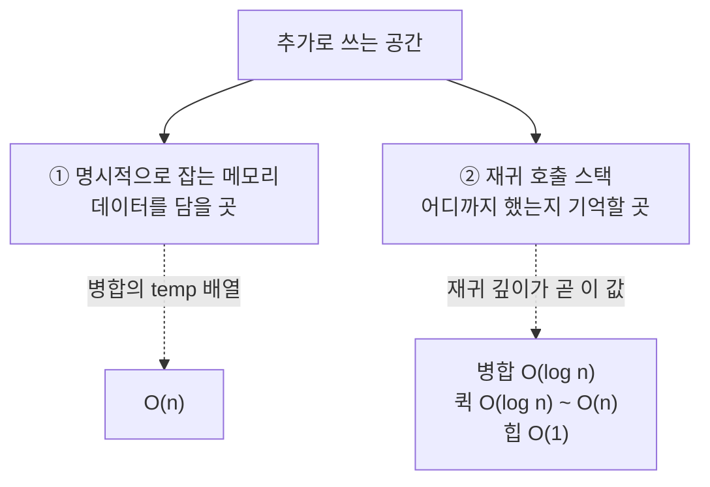

이 관점에서 정렬 알고리즘들을 조금 더 자세히 뜯어보면 다음과 같다.

- **병합 정렬** — 명시적으로 원소 개수에 따른 배열을 따로 저장해야 하기에
  `n`의 공간이 필요하며, 추가적으로 `log n`만큼 단계가 있기에 재귀 스택을
  고려하면 최종적으로 `O(n)`으로 볼 수 있다. 두 항 중 큰 쪽이 `n`이므로
  `O(n) + O(log n) = O(n)`이다.
- **퀵 정렬** — 명시적으로 다른 메모리가 필요한 것은 아니며, 재귀 스택의
  경우만 피벗이 어느 지점에 잡히느냐에 따라서 `log n ~ n`으로 변동이 있다고 볼
  수 있다.
- **힙 정렬** — 트리 구조가 실제로 존재하는 것이 아니라 주어진 배열이 특정
  규칙에 따라 정렬된 것이므로 따로 명시적인 메모리가 요구되지 않으며, 단계가
  `log n`만큼 존재하기에 `log n`으로 볼 수도 있으나, 재귀 깊이 부분에서도
  보았듯이 **반복문으로 구현한다면 `O(1)`로도 가능**하므로 셋 중에 힙 정렬이
  공간 복잡도는 가장 낮다고 볼 수 있다.

| 알고리즘 | ① 명시적 메모리 | ② 재귀 스택 | 합계 |
| --- | :---: | :---: | :---: |
| merge | `O(n)` (`temp` 배열) | `O(log n)` | **`O(n)`** |
| quick | 없음 | `O(log n)` ~ **`O(n)`** | **`O(log n)` ~ `O(n)`** |
| heap | 없음 | **`O(1)`** (반복문) | **`O(1)`** |

이 부분을 좀 더 공부해 보면서, 데이터가 커짐에 따라서 단순히 연산 시간뿐
아니라 쓰이는 메모리까지 어떻게 변하는지 검토해 볼 수 있었다. 또한 전에는
재귀 함수의 반복이 많아졌을 때 느려지거나 꺼지는 것을 **연산량이 많아져서**
그런 줄 알았는데, **재귀 스택 때문일 수도 있겠다**는 시각까지 얻을 수 있게
되었다.

---

## 3. 소감 및 결론

결론적으로 봤을 때, **세 가지 알고리즘은 각각 한 가지씩은 포기했다**고 볼 수
있다. 세 정렬 모두 평균은 `O(n log n)`이다. 그렇지만,

- **병합**의 경우는 해당 복잡도를 달성하기 위하여 `temp` 배열 `n`개를 따로
  저장해야 하는 메모리 소모가 다른 정렬들에 비해 필요하였다.
- **퀵**은 메모리를 거의 안 쓰고 통상적으로 가장 빠른 정렬 중 하나이지만,
  최악의 경우 `O(n²)`이 존재한다. 전부 정렬된 케이스 같은 특정 상황에서는
  예상된 결과 도출 시간을 초과하는 문제가 발생한다. 실제로 `n = 8,192`에서
  정렬된 입력을 주자 무작위 입력의 **28배**(0.378ms → 10.585ms)가 걸렸다.
- **힙**의 경우는 최악도 `O(n log n)`이며 메모리도 `O(1)`이라 모두 괜찮아
  보이지만, **무작위 입력에서는 실제 측정 속도가 가장 느린 것으로 드러났다.**
  비교 횟수가 병합의 약 2배(187,630 대 96,146)인 것이 그 원인으로 보인다.

이에 따라서, 힙 정렬은 메모리와 최악 보장은 있으나 평균적인 실측 속도가
부족하기에 **세 가지 모두 한 가지씩의 결점은 지니고 있음**을 알 수 있다.

| | 포기한 것 | 얻은 것 |
| --- | --- | --- |
| 병합 | 추가 메모리 `O(n)` · (안정성은 지킴) | 입력을 타지 않는 `O(n log n)` · 안정 |
| 퀵 | 최악 `O(n²)` · 불안정 | 평균 최고 속도 · 메모리 거의 0 |
| 힙 | 평균 속도 (상수가 크다) | 최악도 `O(n log n)` · 메모리 `O(1)` |

개인적으로 이 프로젝트를 하면서 느낀 부분이, 교수님께서 말씀하신 바이브 코딩을
하면서 코딩 부분은 AI와 함께하되 **알고리즘의 구조와 그와 관련된 부분은 확실히
스스로 AI와 함께 학습하며** 수업 시간에 배웠던 것을 복습하고 더 확장해 볼 수도
있었다는 사실이 흥미로웠다.

비록 코드에 관한 건 대부분 샘플 저장소를 참조하고 바이브 코딩이 대부분을
차지하였다는 것이 조금은 아쉽지만, 세세한 부분에 집중하기보다는 전반적인 코드
구조와 알고리즘 작용 방식 파악에 집중할 수 있어서 훨씬 효율적인 작업 또한
성취할 수 있었다고 생각한다.
